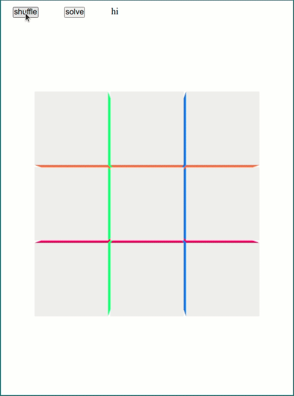

# cube-solver

A program that solves the 3x3 rubik's cube

## For demo

https://lexseal.github.io/cube-solver/



## How to run

```python3
python3 solver.py [-h] [-s STR] [-m MOVES] [-d] [-n NUMBER] [-c] [-nm NUMERIC_MOVE]
```

## Implementation

This implements Kociemba's Two-Phase solver without any fancy group theory. Under the hood, it uses similar coordinate system, representing the configuration of a cube in a 3 tuple. 

A table indexed by the three tuples is generated to store the number of moves needed to get to each configuration from the start.

The program then uses iterative deepening search to try to brute froce the solution, while pruning configurations we know takes more moves to solve than allowed.

While searching, it searches 3 parallel cubes, rotated 120 degrees on the opposite diagonal. I found this quicker than 6 parallel threads on a laptop due to power limit and down clocking.

## Performance

Solves most random cube under 1/4 second with 22 moves or fewer.

## Interface

The visual interface is built with three.js
